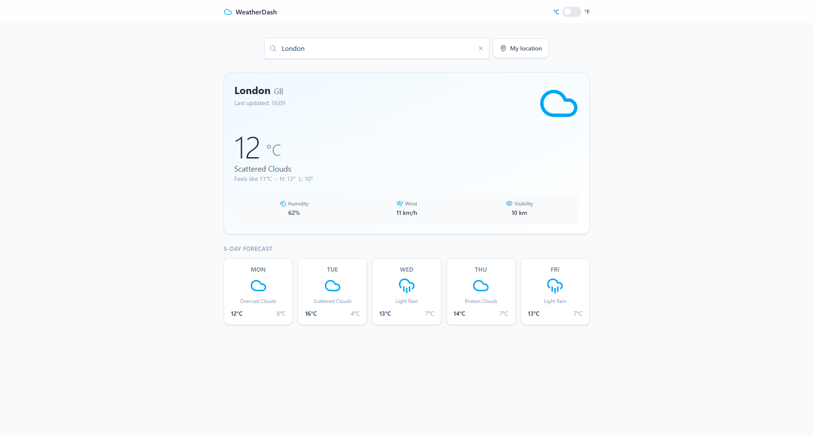
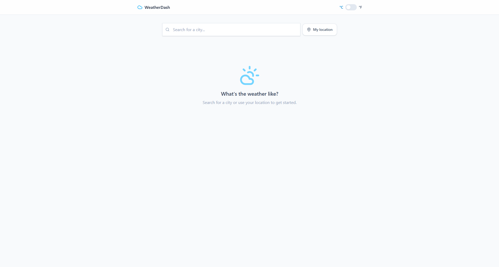
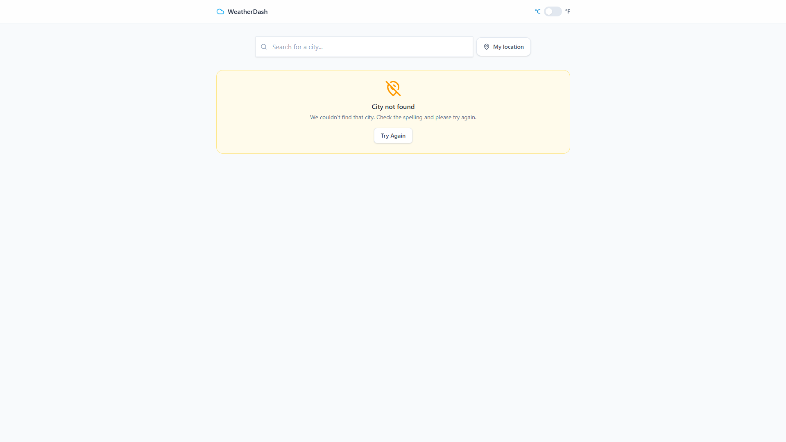

# 🌤️ Weather Dashboard

<div align="center">
  <!-- TODO: Drop your main showcase screenshot here and replace the path -->
  
</div>

<br />

<div align="center">
  <strong>A modern, responsive, and secure Weather SPA built with React 18, Vite, and TypeScript.</strong>
</div>

<div align="center">
  <br />
  <a href="https://weather-dashboard-contactalangreen.vercel.app"><b>Live Demo</b></a> &nbsp;&nbsp;|&nbsp;&nbsp;
  <a href="https://github.com/orgs/ContactAlanGreen-Portfolio-s/projects/2"><b>Project Kanban</b></a> &nbsp;&nbsp;|&nbsp;&nbsp;
  <a href="https://github.com/ContactAlanGreen-Portfolio-s"><b>My GitHub Portfolio</b></a> &nbsp;&nbsp;|&nbsp;&nbsp;
  <a href="https://www.linkedin.com/in/contactalangreen/"><b>LinkedIn</b></a>
  <br />
</div>

---

## 📖 Overview

This Weather Dashboard is **Project 2** in my full-stack engineering portfolio. It is designed to be a production-ready Single Page Application (SPA) that queries real-time weather data and 5-day forecasts via the OpenWeatherMap API.

Rather than just building a simple frontend, this project focuses heavily on **architecture, security, and developer experience**. It implements a secure API proxy, robust state management, intelligent caching, and an automated CI/CD pipeline.

<div align="center">
  <!-- TODO: Add your empty state screenshot -->
  
  <!-- TODO: Add your error state screenshot -->
  
</div>

## ✨ Key Features

- **Real-Time Weather & 5-Day Forecast**: Fetches current conditions and groups 3-hour forecast intervals into daily summaries.
- **Location Detection**: Geolocation API integration to get weather for the user's current location.
- **Smart Search**: Debounced city search to prevent API spam, with robust error handling for "City Not Found".
- **Unit Toggling**: Seamlessly switch between Metric (°C, km/h) and Imperial (°F, mph) units.
- **Persistent Preferences**: User unit preferences and last searched city are saved to `localStorage` and automatically restored.
- **Accessibility & UX**: Skeleton loading states (no spinners), ARIA labels, and fully responsive layout (Mobile to Desktop).

## 🛠️ Tech Stack

- **Framework**: [React 18](https://react.dev/) + [Vite](https://vitejs.dev/)
- **Language**: [TypeScript](https://www.typescriptlang.org/) (Strict Mode)
- **Styling**: [Tailwind CSS v4](https://tailwindcss.com/)
- **Data Fetching & Caching**: [TanStack Query v5](https://tanstack.com/query/latest)
- **Global State Management**: [Zustand](https://zustand-demo.pmnd.rs/) (with `persist` middleware)
- **Icons**: [Lucide React](https://lucide.dev/)
- **Testing**: [Vitest](https://vitest.dev/) (Unit/Component) + [Playwright](https://playwright.dev/) (E2E)
- **CI/CD**: GitHub Actions
- **Deployment**: [Vercel](https://vercel.com/) (Frontend + Serverless Functions)

## 🏗️ Architecture & Security Highlights

### 1. API Key Security (Vercel Serverless Functions)
A common mistake in frontend apps is exposing API keys in the browser bundle (e.g., using `VITE_API_KEY`). This project uses **Vercel Serverless Functions** (`api/weather.ts` and `api/forecast.ts`) to act as a proxy. The React app never sees the OpenWeatherMap API key—it only communicates with the secure proxy.

### 2. Data Transformation at the Boundary
Raw API responses are never passed directly into UI components. A dedicated `transformers.ts` layer intercepts the data, normalises it, and outputs strict TypeScript interfaces (`CurrentWeather` and `DailyForecast`). This isolates the UI from future API schema changes.

### 3. Intelligent Caching
To protect the free tier of the OpenWeather API, TanStack Query is configured with a **10-minute `staleTime`** and disables `refetchOnWindowFocus`. Combined with a **500ms debounce** on the search input, this aggressively minimises redundant network requests.

### 4. Robust Testing Suite
- **Unit Tests**: Ensure 100% accuracy on complex temperature/wind conversions and data transformers.
- **Component Tests**: Verify UI rendering across Loading, Error, Empty, and Success states.
- **E2E Tests**: Playwright scripts simulate real user journeys against the deployed production app.

---

## 🚀 Getting Started (Local Development)

To run this project locally, you will need an API key from [OpenWeatherMap](https://openweathermap.org/api).

### Prerequisites
- Node.js v20+
- Vercel CLI (`npm i -g vercel`) — *Required to run the serverless API proxy locally.*

### Installation

1. **Clone the repository:**
   ```bash
   git clone https://github.com/ContactAlanGreen-Portfolio-s/weather-dashboard.git
   cd weather-dashboard
   ```

2. **Install dependencies:**
   ```bash
   npm install
   ```

3. **Set up Environment Variables:**
   Rename `.env.example` to `.env.development.local` and add your API key:
   ```env
   OPENWEATHER_API_KEY=your_api_key_here
   ```

4. **Start the development server:**
   ```bash
   vercel dev
   ```
   *Note: Using `npm run dev` will start the Vite frontend, but the `/api` routes will return 404s. You must use `vercel dev` to run the frontend and the serverless proxy together.*

---

## 🤖 CI/CD Pipeline

This repository is protected by a **GitHub Actions** workflow (`ci.yml`) that runs on every Push and Pull Request to `main`. It enforces:
1. `npm run type-check` (Strict TypeScript compilation)
2. `npm run lint` (ESLint rule enforcement)
3. `npx prettier --check .` (Code formatting)
4. `npm run test` (Vitest Unit & Component tests)

The `main` branch is protected and requires all CI checks to pass before merging.

---

## 👨‍💻 About the Author

**Alan Green**  
Passionate full-stack dev focused on building scalable, accessible, and performant web applications. 

- **LinkedIn:** [linkedin.com/in/contactalangreen](https://www.linkedin.com/in/contactalangreen/)
- **GitHub:** [ContactAlanGreen-Portfolio-s](https://github.com/ContactAlanGreen-Portfolio-s)

*Feel free to reach out if you'd like to discuss this project or potential opportunities!*
